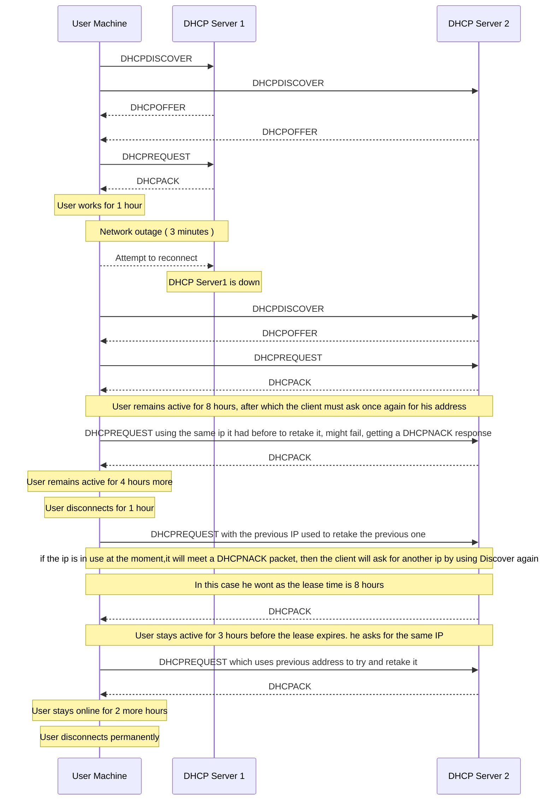

# SRI

```mermaid
sequenceDiagram
    participant Client as User Machine
    participant DHCP1 as DHCP Server 1
    participant DHCP2 as DHCP Server 2
    Client ->> DHCP1: DHCPDISCOVER 
    Client ->> DHCP2: DHCPDISCOVER 
    DHCP1 -->> Client: DHCPOFFER 
    DHCP2 -->> Client: DHCPOFFER 
    Client ->> DHCP1: DHCPREQUEST
    DHCP1 -->> Client: DHCPACK
    Note over Client: User works for 1 hour
    Note over Client, DHCP1: Network outage ( 3 minutes )
    Client -->> DHCP1: Attempt to reconnect
    Note over DHCP1: DHCP Server1 is down
    Client ->> DHCP2: DHCPDISCOVER 
    DHCP2 -->> Client: DHCPOFFER 
    Client ->> DHCP2: DHCPREQUEST 
    DHCP2 -->> Client: DHCPACK 
    Note over Client,DHCP2: User remains active for 8 hours, after which the client must ask once again for his address
    Client ->> DHCP2: DHCPREQUEST using the same ip it had before to retake it, might fail, getting a DHCPNACK response
    DHCP2 -->> Client: DHCPACK
    Note over Client: User remains active for 4 hours more
    Note over Client: User disconnects for 1 hour
    Client ->> DHCP2: DHCPREQUEST with the previous IP used to retake the previous one
    Note over Client,DHCP2:if the ip is in use at the moment,it will meet a DHCPNACK packet, then the client will ask for another ip by using Discover again
    Note over Client,DHCP2: In this case he wont as the lease time is 8 hours
    DHCP2 -->> Client: DHCPACK 
    Note over Client,DHCP2: User stays active for 3 hours before the lease expires. he asks for the same IP
    Client ->> DHCP2: DHCPREQUEST which uses previous address to try and retake it
    DHCP2 -->> Client: DHCPACK
    Note over Client:User stays online for 2 more hours
    Note over Client: User disconnects permanently
```
